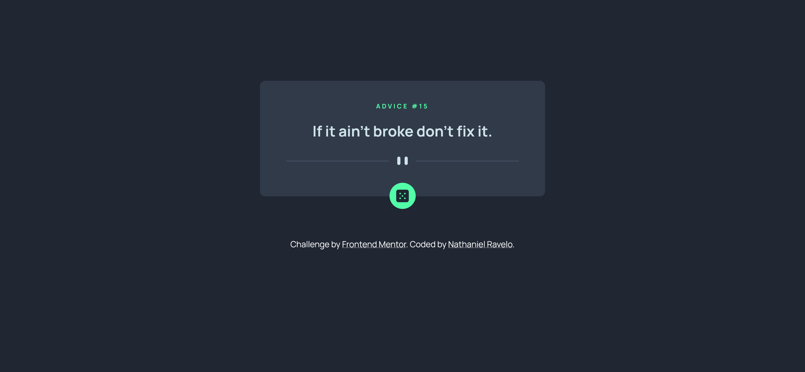

# Frontend Mentor - Advice generator app solution

This is a solution to the [Advice generator app challenge on Frontend Mentor](https://www.frontendmentor.io/challenges/advice-generator-app-QdUG-13db). Frontend Mentor challenges help you improve your coding skills by building realistic projects.

## Table of contents

- [Overview](#overview)
  - [The challenge](#the-challenge)
  - [Screenshot](#screenshot)
  - [Links](#links)
- [My process](#my-process)
  - [Built with](#built-with)
  - [What I learned](#what-i-learned)
- [Author](#author)

**Note: Delete this note and update the table of contents based on what sections you keep.**

## Overview

### The challenge

Users should be able to:

- View the optimal layout for the app depending on their device's screen size
- See hover states for all interactive elements on the page
- Generate a new piece of advice by clicking the dice icon

### Screenshot

### Links

- Solution URL: https://github.com/nmr15/FEM-advice-generator
- Live Site URL: https://github.com/nmr15/FEM-advice-generator/tree/main

## My process

### Built with

- Flexbox
- SASS
- [React](https://reactjs.org/) - JS library

### What I learned

I had a problem while deploying to Netlify. Some error about axios. I fixed it by directly importing axios from the node_modules folder.

import axios from '../node_modules/axios/index'

## Author

- Website - https://nathanielravelo.com/
- Frontend Mentor - https://www.frontendmentor.io/profile/nmr15
- Github - https://github.com/nmr15
